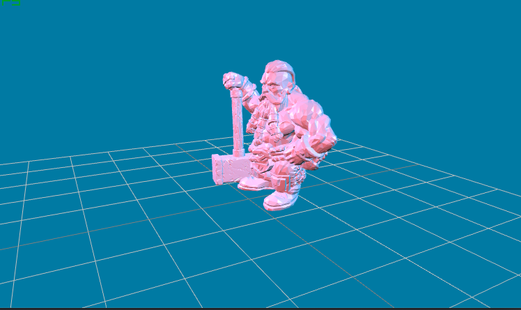

# spine-raylib

The stl-loader-for-raylib runtime provides functionality to load, manipulate and render stl files on raylib.

One of the most amazing features of [Raylib](https://www.raylib.com/), besides the ease of use and its numerous ports to several languages, is the ability to compile to [WebAssembly](https://webassembly.org/), allowing to show your games around the world with just a link.

## Known Bugs
None AFAIK 

## Licensing

This code is provided "As Is", I'm not responsible for any harm you can cause to others or to yourself with this toy project of mine.

## Licensing

## Examples

This CMake-based project is an example of how to use the library on a 3D setting.

### Example
[Example](https://htmlpreview.github.io/?https://github.com/WEREMSOFT/stl-loader-for-raylib/blob/master/html/main.html)

## Setup

1. Use the file src/main.c as a starting point.
1. Compile and run. If you need extra help compiling in the different platforms, check the awesome [Raylib documentation](https://github.com/raysan5/raylib/wiki) under the **Development Platforms** section.

## Notes

The function and defines is on stl_loader.h.

This project is based on CMake as a build pipeline.
